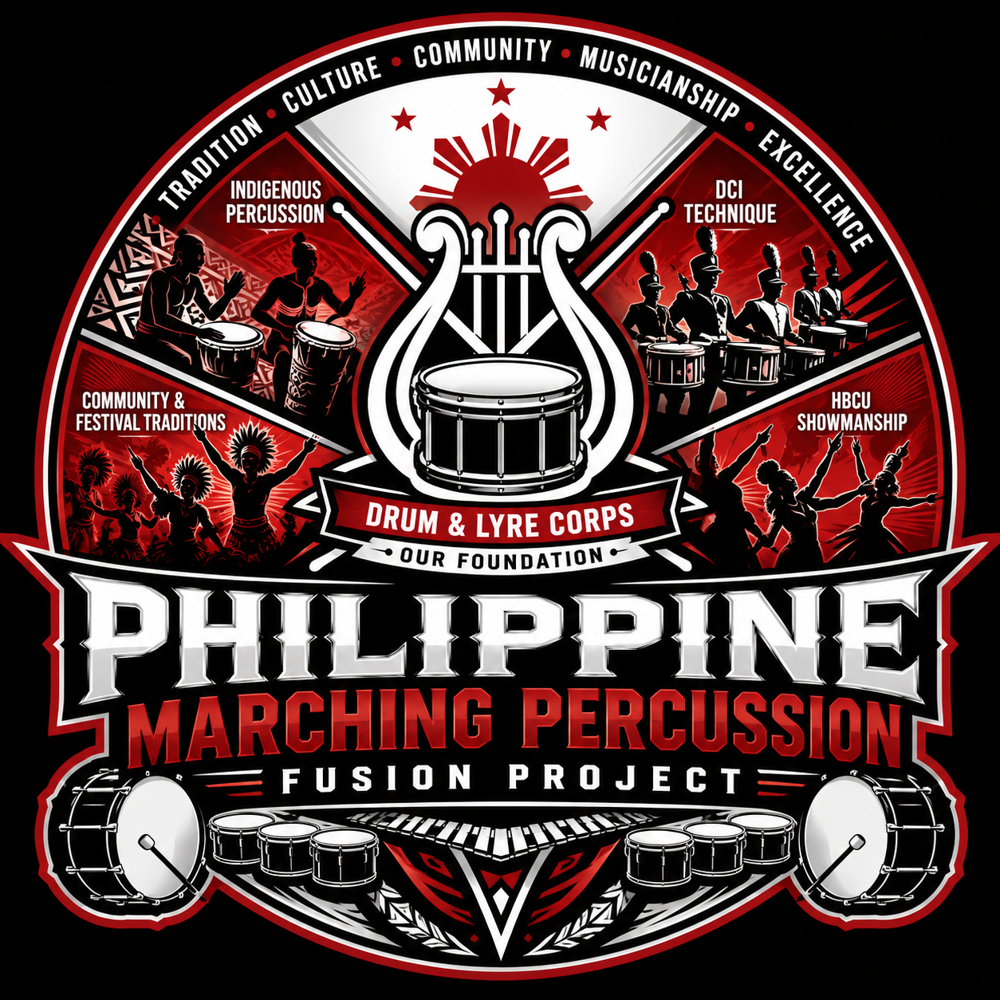

# The Philippine Marching Percussion Fusion Project



> Preserving the soul of Philippine street drumming while elevating it through modern marching percussion technique, notation, education, and performance design.

## Project Overview

The Philippine Marching Percussion Fusion Project is an educational, musical, and cultural initiative dedicated to developing a uniquely Filipino style of modern marching percussion.

The project combines:

- traditional Philippine Drum & Lyre and festival drumming;
- Drum Corps International (DCI) battery technique and arranging;
- Historically Black Colleges and Universities (HBCU) showmanship and visual performance.

The objective is not to imitate an American marching style. It is to preserve Philippine rhythmic identity while introducing advanced notation, pedagogy, arranging methods, technical development, and visual presentation.

## Start Here

The authoritative documentation entry point is the [Project Index](PROJECT_INDEX.md).

Key documents:

- [Project Charter](PROJECT_CHARTER.md)
- [Instructor Introduction](docs/User_Guides/Instructor_Introduction.md) — for music educators and pilot collaborators
- [Core Blueprint](docs/Specifications/Core_Blueprint.md)
- [Documentation Architecture](docs/Architecture/Documentation_Architecture.md)
- [Concept Library](docs/Reference/Concept_Library.md)
- [AI Repository Workflow](docs/AI/Repository_Workflow.md)
- [Architecture Decision Index](ARCHITECTURE_DECISIONS.md)

## Current Status

The project is in its foundation stage.

Current priorities are:

1. establish the EDF-compatible documentation structure;
2. define project principles, terminology, and notation standards;
3. configure the MuseScore Studio 4 and Muse Drumline workflow;
4. create a three-part technical warm-up package;
5. compose a 16-bar proof-of-concept hybrid cadence;
6. test the material with local performers.

## Technology and Production Environment

- MuseScore Studio 4
- Muse Hub
- Muse Drumline (MDL2)
- Apple Silicon Mac mini
- GitHub as the canonical source of truth
- Obsidian as an optional local documentation browser

## Repository Structure

```text
.
├── README.md
├── PROJECT_INDEX.md
├── PROJECT_CHARTER.md
├── ARCHITECTURE_DECISIONS.md
├── CHANGELOG.md
├── ENGINEERING_DOCUMENTATION_FRAMEWORK.md
├── assets/
├── docs/
├── scores/
├── audio/
├── references/
├── scripts/
├── reports/
├── tasks/
└── archive/
```

See [Documentation Architecture](docs/Architecture/Documentation_Architecture.md) for document placement rules.

## Guiding Principle

Success will be measured by whether audiences recognize the result as proudly and authentically Filipino while also hearing greater precision, sophistication, clarity, and educational depth.
